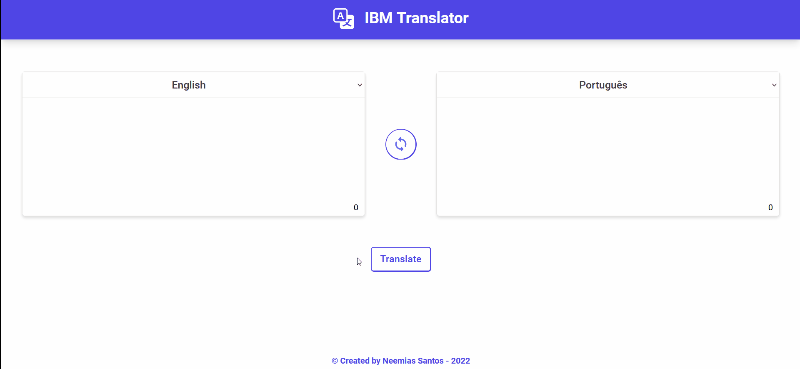

# IBM language translator web app :globe_with_meridians:
A language translator web app made with React and TailwindCss and it's hosted on Firebase

## Preview :fire:

## Demo :video_game:
This app can be accessed from [here](https://langtranslator.firebaseapp.com/)

## Core technologies :toolbox:
> 
> 
> 
> 
> 
> 
> 
> 
> 
> 

## Core libraries :books:
- Axios
- React-icons

## License :memo:
This project is under the MIT License
